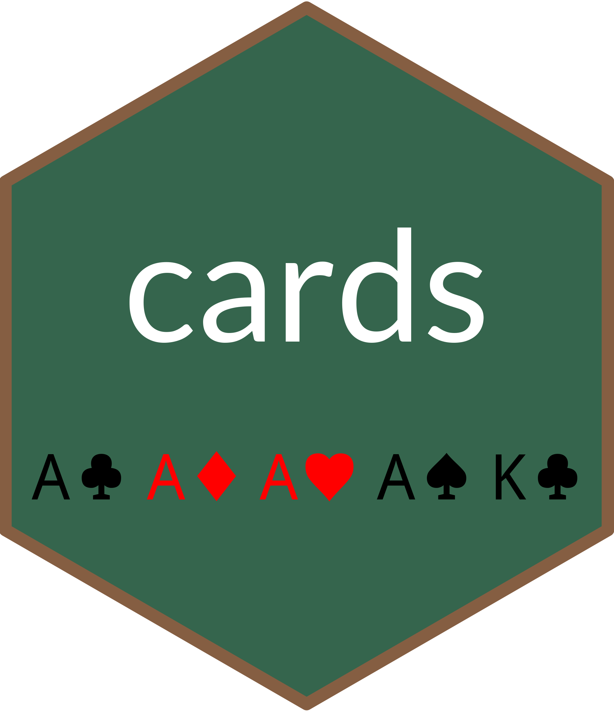

<!-- README.md is generated from README.Rmd. Please edit that file -->

# cards 

<!-- badges: start -->

[](https://github.com/jabenninghoff/cards/actions)
[](https://github.com/jabenninghoff/cards/actions)
[](https://app.codecov.io/gh/jabenninghoff/cards?branch=main)
<!-- badges: end -->

## Overview

**Card Simulation Tools:** Tools for card game simulations, written in
base R.

Feel free to use and/or fork this project!

## Installation

You can install the development version of cards from
[GitHub](https://github.com/) with:

``` r
# install.packages("remotes")
remotes::install_github("jabenninghoff/cards")
```

Or using renv:

``` r
# install.packages("renv")
renv::install("jabenninghoff/cards")
```

## Development

- Changelog: See “Changelog” or `NEWS.md`.
- Planned: [TODO](TODO.md)

## Usage

The cards package supports random draws and evaluation of poker rank
[category](https://en.wikipedia.org/wiki/List_of_poker_hands):

``` r
library(cards)

deck <- new_deck()
replicate(50, {
  hand <- deal_hand(deck)
  paste0(print_hand(hand), ": ", eval_hand(hand))
})
#>  [1] "4S 4C 9H KS TC: one_pair"     "TH KS KC 2D 2C: two_pair"    
#>  [3] "6D QS 9H 2C 8C: high_card"    "3H 3D JS TH 4H: one_pair"    
#>  [5] "4H 3D TD QC 5D: high_card"    "QD TD JD AH 8S: high_card"   
#>  [7] "5D 5H 2D 9D 7D: one_pair"     "7S 8C 3C TS 4S: high_card"   
#>  [9] "9H 4S 9S 2D 7D: one_pair"     "KC 2H 6H 3D 8D: high_card"   
#> [11] "TS TC 7C AC 4C: one_pair"     "3C 6D 5H 7S 2D: high_card"   
#> [13] "5S 2S 4H 4S 9S: one_pair"     "7S TS 6S KH KC: jacks_better"
#> [15] "TD 7D AD 6S 9H: high_card"    "QC 7S 3H JS 9D: high_card"   
#> [17] "4S 3D AS 6S AC: jacks_better" "QD 7C 4H 8D 2D: high_card"   
#> [19] "8D 7D JS QC QS: jacks_better" "9H 9D 5S 5H 3D: two_pair"    
#> [21] "9C AH JS KC QD: high_card"    "3S KH 5H AH 3C: one_pair"    
#> [23] "TH 4D QH JC JS: jacks_better" "AD KC AC 3S 7C: jacks_better"
#> [25] "5H 8C 5C 3H 7S: one_pair"     "2S QC JC 3S 6D: high_card"   
#> [27] "8C JC 4D 9D 9H: one_pair"     "8D QD 5C 2C JC: high_card"   
#> [29] "5D JS 9C 5S QD: one_pair"     "7C 4H KH 9C 9D: one_pair"    
#> [31] "6H 7C QH 6S 2H: one_pair"     "7S 9H JC 4S 5S: high_card"   
#> [33] "QH AH KH 2C JS: high_card"    "QD AD 9D 7S KC: high_card"   
#> [35] "7D 3C QS 7H QH: two_pair"     "8S AS 2C JS 6H: high_card"   
#> [37] "AD 4S 7H 8S TS: high_card"    "6S 3C TS 5S JH: high_card"   
#> [39] "3C 8D JC 4S 3D: one_pair"     "7S 3C 5S 8H 2S: high_card"   
#> [41] "4H QS 4C 3C 6C: one_pair"     "9D JH AD KH TD: high_card"   
#> [43] "KS KD JS 7H 3S: jacks_better" "KD TH 8H KS JS: jacks_better"
#> [45] "9H 8C QH JD TD: straight"     "2S 9H 5D 7S 8D: high_card"   
#> [47] "9D AH QS 2S AS: jacks_better" "JC 5D QC 6H 3C: high_card"   
#> [49] "5H 4C JC 8C 8S: one_pair"     "KS 2C 2H 7C AD: one_pair"
```
