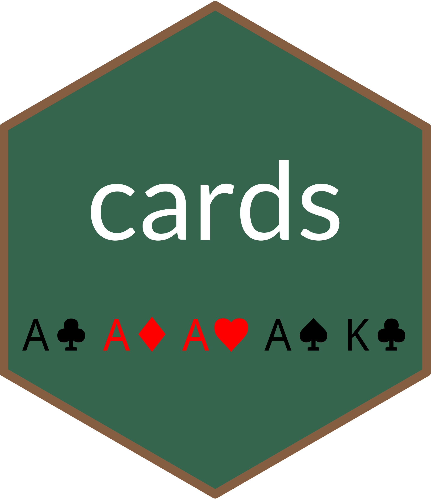

<!-- README.md is generated from README.Rmd. Please edit that file -->

# cards 

<!-- badges: start -->

[](https://github.com/jabenninghoff/cards/actions)
[](https://github.com/jabenninghoff/cards/actions)
[](https://app.codecov.io/gh/jabenninghoff/cards)
<!-- badges: end -->

## Overview

**Card Simulation Tools:** Tools for card game simulations, written in
base R.

Feel free to use and/or fork this project!

## Installation

You can install the development version of cards from
[GitHub](https://github.com/) with:

``` r
# install.packages("remotes")
remotes::install_github("jabenninghoff/cards")
```

Or using renv:

``` r
# install.packages("renv")
renv::install("jabenninghoff/cards")
```

## Development

- Changelog: See “Changelog” or `NEWS.md`.
- Planned: [TODO](TODO.md)

## Usage

The cards package supports random draws and evaluation of poker rank
[category](https://en.wikipedia.org/wiki/List_of_poker_hands):

``` r
library(cards)

deck <- new_deck()
replicate(50, {
  hand <- deal_hand(deck)
  paste0(print_hand(hand), ": ", eval_hand(hand))
})
#>  [1] "AS 4C KC JC KS: jacks_better" "AH 9D 7H 8S 6S: high_card"   
#>  [3] "7H 3H TD JD QH: high_card"    "TC 8D 3S 9S 8S: one_pair"    
#>  [5] "AS 8D 4H 9C TH: high_card"    "2H QS 9H 6H JS: high_card"   
#>  [7] "2D 7C JD 4D 6C: high_card"    "4S 7S QD 3H 9C: high_card"   
#>  [9] "QH KS TH 8S 9D: high_card"    "8H AS JH 3H 9C: high_card"   
#> [11] "4H TC 4D 3D 3S: two_pair"     "KS QH 4D TC 7S: high_card"   
#> [13] "QD 3S 3C KC 7H: one_pair"     "9H 6S AH TH 4C: high_card"   
#> [15] "6D 5D KS AD 6S: one_pair"     "AH 6D 5H QH 6S: one_pair"    
#> [17] "AH 8D 7D 6C 2C: high_card"    "AH TD AS QH 9D: jacks_better"
#> [19] "8C 9S 9H 4S JH: one_pair"     "9D AH QH 4C 2C: high_card"   
#> [21] "KD 8D TC TS 7S: one_pair"     "AH QH 2S KD 3H: high_card"   
#> [23] "TC KS 9C QD KH: jacks_better" "AH 8C TS AS TH: two_pair"    
#> [25] "AH 6D TD 5C 9C: high_card"    "4H 8C JH QS AH: high_card"   
#> [27] "9D KH JD 5H 6S: high_card"    "8H JS 9D 9S TH: one_pair"    
#> [29] "9H 6H 4S 4D 6C: two_pair"     "TC KC TS 2H JC: one_pair"    
#> [31] "JC 5D JH 4C TD: jacks_better" "8C 8D 7S KC 5H: one_pair"    
#> [33] "QS 9C 9H 5H 7C: one_pair"     "2S 3C 4C TH 2D: one_pair"    
#> [35] "2D 7H 4H 6C 4C: one_pair"     "6C 6S 3C JC 4H: one_pair"    
#> [37] "5C 8S 5S 6S 2D: one_pair"     "8S 5C 8D AD QS: one_pair"    
#> [39] "4D 3D TC 7D 2H: high_card"    "AD 3S 4D 6S 6D: one_pair"    
#> [41] "4S JH 8S 9S AS: high_card"    "AS JH 5C 7H AD: jacks_better"
#> [43] "QS 8D 6H 7S 5D: high_card"    "JD QS TS AS 5D: high_card"   
#> [45] "7D 7C 4H KD 5D: one_pair"     "4C 5D 3S 8H JS: high_card"   
#> [47] "KC 5D 4S JH TH: high_card"    "AS 7S 5C KC AH: jacks_better"
#> [49] "9D 5H AD 7C 8C: high_card"    "8S 8D 4C 2D 9H: one_pair"
```
